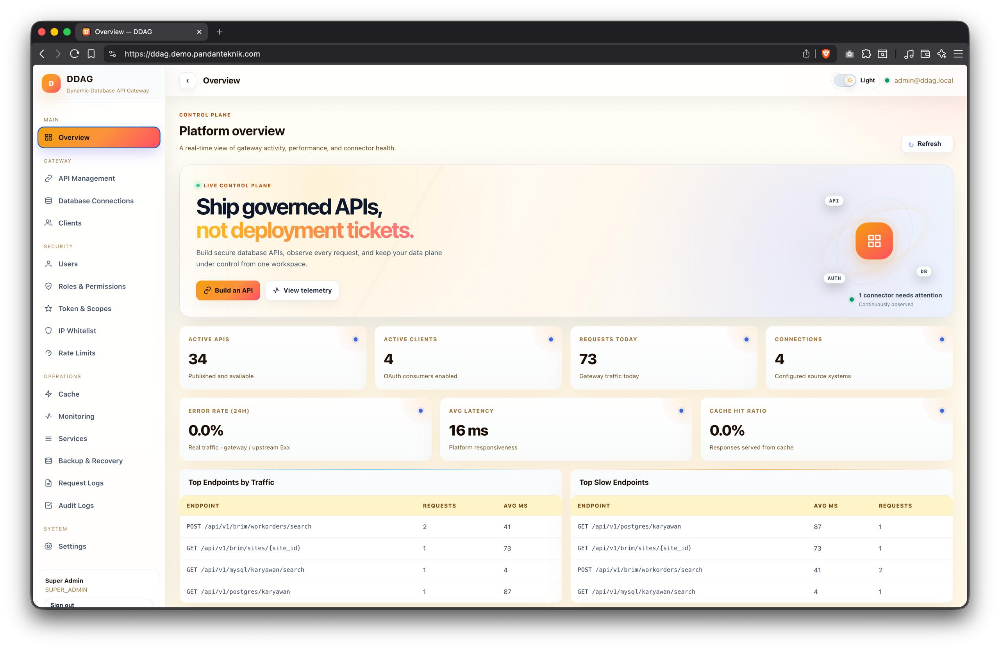

# DDAG — Dynamic Database API Gateway

**Publish governed SQL as secure, observable APIs—without building a backend service for every endpoint.**

[](LICENSE)
[](go.mod)
[](apps/dashboard)
[](docs/ARCHITECTURE.md)
[](docs/HTTP_QUERY.md)

[Live demo](https://ddag.demo.pandanteknik.com) · [Architecture](docs/ARCHITECTURE.md) · [Deployment](docs/DEPLOY_VPS.md) · [Security](SECURITY.md)



## What is DDAG?

DDAG is a self-hosted control plane and data plane for database-backed APIs. Define an HTTP route, bind typed request parameters to parameterized SQL, apply access policies, and publish. DDAG handles authentication, authorization, execution, caching, audit records, metrics, and OpenAPI documentation.

It is designed for teams that need a consistent API layer across PostgreSQL, MySQL/MariaDB, Oracle, and SQL Server without maintaining a separate service for every query.

> **Project status:** DDAG is pre-1.0. PostgreSQL is the primary end-to-end development path. The MySQL, Oracle, and SQL Server connectors build from the shared connector architecture, but broader live-engine integration coverage is still wanted. Pin deployments to a reviewed commit and test against your own database versions and drivers.

## Core capabilities

| Area | Capability |
|---|---|
| API lifecycle | Draft, validate, publish, deprecate, and retire route definitions |
| Database access | PostgreSQL, MySQL/MariaDB, Oracle, and SQL Server connectors |
| Query safety | Typed parameters, dialect-aware binding, query timeout, row limits, and operation validation |
| Identity and policy | OAuth 2.0 client credentials, RS256 JWTs, scopes, API grants, RBAC, IP allowlists, and rate limits |
| Security | Envelope-encrypted secrets, AAD-bound ciphertext for new writes, internal HMAC authentication, and replay protection |
| Reliability | Connection pools, circuit breakers, backpressure, read-only response caching, and corrupt-cache fallback |
| Observability | Request IDs, structured logs, audit records, Prometheus metrics, and operation-aware request logs |
| API contract | Generated OpenAPI 3 documentation, Swagger UI, and HTTP `QUERY` support based on RFC 10008 |

## How it works

```text
Client
  │  OAuth bearer token
  ▼
API Gateway ──► policy checks ──► read cache ──► database connector ──► source database
  │                                      │
  ├─► request/audit logs                 └─ parameter binding + timeout + row limit
  └─► OpenAPI catalog

Admin
  ▼
Dashboard ──► control-plane API ──► metadata PostgreSQL
```

The gateway verifies JWTs locally from JWKS, matches a published route, evaluates policy, and dispatches parameterized SQL to the connector for the selected database engine. Write operations never use the response cache and are not classified as safe for automatic retry.

Read the detailed [architecture](docs/ARCHITECTURE.md) and [HTTP `QUERY` compatibility notes](docs/HTTP_QUERY.md).

## Quick start

### Requirements

- Docker Engine or Docker Desktop
- Docker Compose v2
- Git

```bash
git clone https://github.com/RiprLutuk/DDAG.git
cd DDAG
./scripts/quickstart.sh
```

The launcher creates a local `.env` with generated credentials, builds the stack, waits for readiness, and prints the dashboard password.

```text
Dashboard: http://localhost
Gateway:   http://localhost/api/v1/...
Health:    http://localhost/healthz
```

Useful commands:

```bash
./scripts/quickstart.sh status
./scripts/quickstart.sh logs
./scripts/quickstart.sh stop     # preserve local data
./scripts/quickstart.sh reset    # delete local Postgres and Redis volumes
```

The root [`docker-compose.yml`](docker-compose.yml) is the single Compose definition for local evaluation. Optional MySQL, Oracle, and SQL Server connector services are available through the `connectors` profile:

```bash
docker compose --profile connectors up --build
```

The profile starts connector services; you still need reachable source databases and compatible credentials.

## Publish an API

A typical workflow is:

1. Register a source database connection and test connectivity.
2. Create an API definition with an HTTP method, route, SQL template, and typed parameters.
3. Configure scopes, client access, limits, and an optional cache rule for read operations.
4. Validate and publish the definition.
5. Use the generated OpenAPI catalog as the contract for consumers.

Example parameterized SQL:

```sql
SELECT site_id, name, status
FROM sites
WHERE site_id = :site_id
LIMIT :ddag_limit
```

DDAG rewrites named parameters to the target driver's placeholder format and sends values as bound arguments. Do not interpolate untrusted values into SQL templates.

## Deployment

For a native single-VPS installation behind Caddy and systemd, follow the [VPS deployment guide](docs/DEPLOY_VPS.md). Helm manifests and container assets are available under [`deploy/`](deploy/).

Before exposing DDAG publicly:

- use TLS and private networking for metadata PostgreSQL, Redis, and connector ports;
- give every source connection a least-privilege database role;
- replace all development secrets and back up `DDAG_MASTER_KEY` separately;
- restrict dashboard and metrics access;
- configure off-host backups and perform a restore drill;
- pin a reviewed commit or release and run tests against your database engines.

See the [security policy](SECURITY.md), [operations guide](docs/OPERATIONS.md), and [backup and recovery runbook](docs/BACKUP_RECOVERY.md).

## Documentation

| Document | Audience |
|---|---|
| [Architecture](docs/ARCHITECTURE.md) | Engineers evaluating the design and security boundaries |
| [VPS deployment](docs/DEPLOY_VPS.md) | Operators deploying without Kubernetes |
| [Operations](docs/OPERATIONS.md) | On-call and platform operators |
| [Backup and recovery](docs/BACKUP_RECOVERY.md) | Operators validating disaster recovery |
| [HTTP `QUERY`](docs/HTTP_QUERY.md) | API consumers and compatibility reviewers |
| [Testing](docs/TESTING_V3.md) | Contributors running functional and load checks |
| [Metrics catalog](docs/METRICS_CATALOG_V4.md) | Observability and SRE teams |
| [Contributing](CONTRIBUTING.md) | Contributors and integration testers |

## Development

```bash
make build
make test
make vet

cd apps/dashboard
corepack enable
pnpm install --frozen-lockfile
pnpm run build
```

See [CONTRIBUTING.md](CONTRIBUTING.md) before opening a pull request. Live integration coverage for MySQL, Oracle, and SQL Server is particularly valuable.

## Scope and limitations

DDAG reduces repeated API infrastructure work; it is not a substitute for database design, least-privilege roles, network controls, backups, or application-specific business logic. Complex workflows and multi-step transactions may still belong in a dedicated service.

Performance and resource use depend on enabled services, connector count, pool sizes, traffic, cache policy, and source-query cost. Benchmark your own workload rather than relying on a universal footprint claim.

## License

DDAG is available under the [MIT License](LICENSE).
